Berawal saat sedang voice chat di grup discord, seorang teman tiba-tiba bertanya: "gimana ya, liat dm di ig tapi ga ketahuan kalo udah dibaca?"

Sontak otak gua teringat sebuah artikel, yang sebenarnya ga sengaja kebuka pas gua lagi males kerja. Artikel tersebut membahas tentang fitur baru (2019) Instagram untuk mengatasi cyberbullying, yang dinamakan Restrict [(bisa baca juga pernyataan resmi Instagram).](https://about.instagram.com/blog/announcements/instagrams-commitment-to-lead-fight-against-online-bullying)

Intinya, pada artikel itu dibahas kalo pengguna bisa 'membatasi' pengguna lain untuk berinteraksi dengan dirinya, tanpa disadari. Banyak faktor yg membuat seseorang ga bisa semudah itu untuk menggunakan fitur 'Block', salah satunya adalah karena alasan **teman**. Makanya, 'Restrict' bisa jadi sebuah alternatif.

Pasti lu pernah kan, dapat DM dari orang yang _annoying_, terus lu penasaran sama isinya, tapi lu gamau keliatan kalo lu udah ngebaca DM dari dia. Nah, gua membawakan solusi untuk kita bersama, yang gua jamin berhasil. gua anggep solusi ini orisinil, tapi harusnya di dunia lain udah pernah ada yang buat :)

Jadi gini,

disini gua menggunakan dua akun sebagai pembuktian, 
- Akun A sebagai pengirim DM (annoying person)

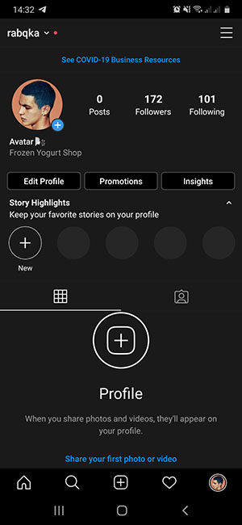

- Akun B sebagai penerima DM (akun gua/lu)

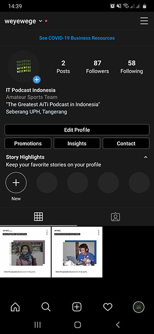

## Tanpa Fitur Restrict

Oke untuk case pertama, gua contohin situasi dimana: akun A sudah mengirimkan DM ke akun B, lalu akun B membacanya. Maka tentu saja tampilan di akun A akan ada tanda 'seen'.

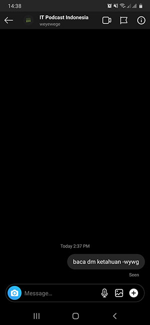

## Dengan Fitur Restrict

Lanjut untuk case kedua, situasinya: akun A mengirim DM ke akun B dengan isi seperti dibawah.

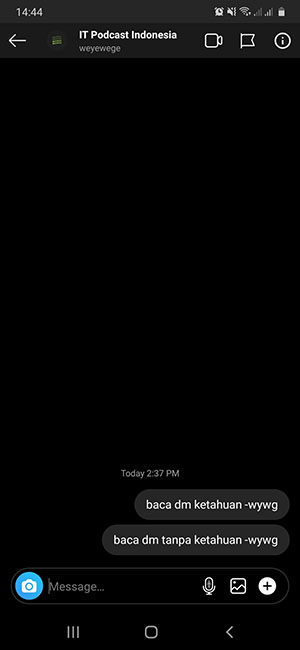
 
Nah, sekarang kita beralih ke sisi akun B, 
saatnya untuk mengaktifkan fitur Restrict, berikut langkahnya:

1. Pergi ke `Settings -> Privacy`

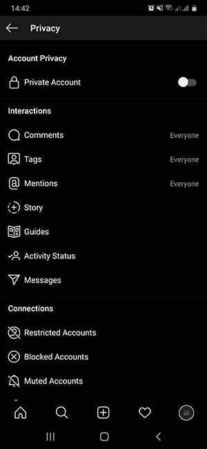

2. Pilih `Restricted Accounts` kemudian cari akun orang yang _nge-dm_, trus tinggal pencet deh tombol Restrict

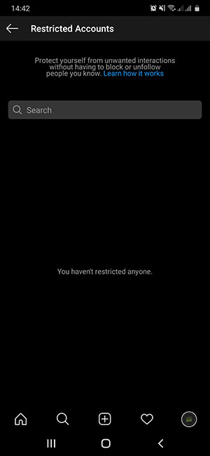

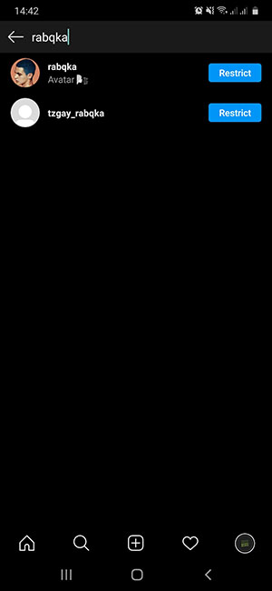

3. Balik ke profile, lalu masuk ke menu direct messages, jika diperhatikan, dm dari akun yang di-_restrict_ akan otomatis masuk ke request

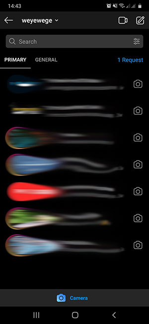

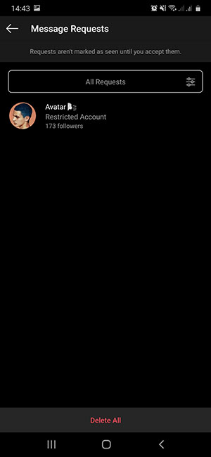

4. Kalo udah seperti itu, sekarang lu bebas buka dm dari akun tersebut, tampilannya akan seperti ini

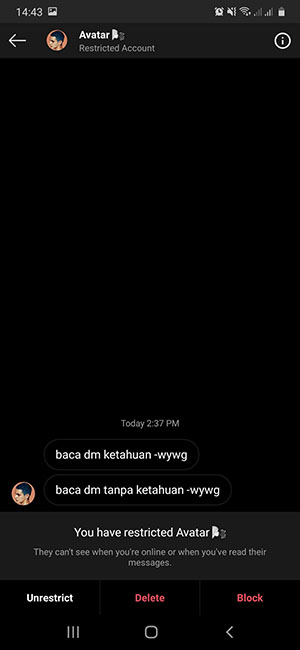

5. Setelah lu membuka dan membaca dm yang ada di request, si pengirim sama sekali tidak akan melihat tanda 'seen', misi selesai.

Eits sebelum gua akhiri,

lu pasti timbul pertanyaan:

'gimana kalo kita unrestrict akun si pengirim dm? apakah tanda seen akan muncul lagi?'

Jawabannya: tidak.

Setelah kita unrestrict, dm dari akun tersebut akan balik ke menu direct messages (bukan request) dan masih belum terbuka, hal itu menjelaskan kenapa di sisi pengirim, dm belum terbaca. 

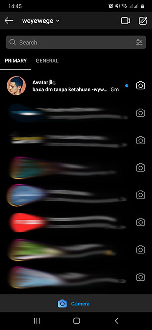

Wow wow wow, sungguh simple kan caranya? penjelasannya aja yang sengaja gua banyakin, biar lu nyimak. Namun, gua yakin, ada aja yang males ngebaca dan ngikutin, atau udah ngikutin tapi belum ngerti. Berhubung gua lagi _happy_ pas nulis ini, nih gua kasih versi video, silakan 

<iframe width="560" height="315" src="https://www.youtube.com/embed/oRK1V8eaGF4" frameborder="0" allow="accelerometer; autoplay; clipboard-write; encrypted-media; gyroscope; picture-in-picture" allowfullscreen></iframe>

 

> Jangan lupa share artikel ini ya demi membantu teman-teman kita yang membutuhkan, biar mereka ga nanya lagi, cheers!
