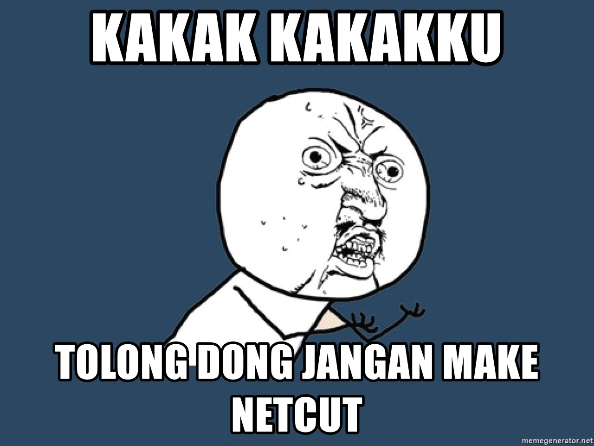
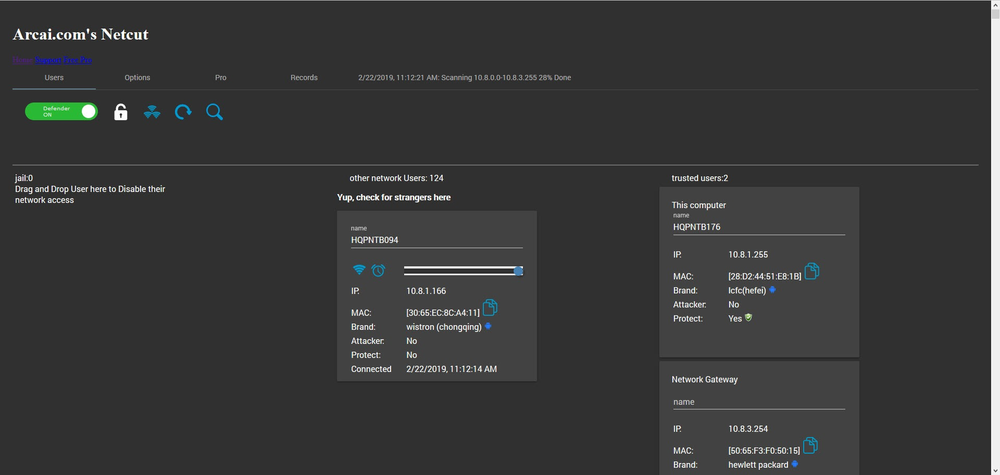

"Duh! koneksinya kok gabisa sih???" ujar seorang polos yang sedang mencoba menikmati jaringan publik. Dari tempat yang berseberangan, terlihat pemuda sedang asik **menambah koleksi unduhan film baru**. Sekilas ia tampak tersenyum menyeringai.

Kira-kira seperti itulah skenario yang terjadi saat gua masih sering menggunakan Netcut. 

Lalu, apa itu Netcut? Singkatnya, aplikasi untuk memutus koneksi internet dari perangkat yang tersambung ke jaringan publik, semisal wifi kampus, wifi kafe, lab komputer hingga warnet. Alhasil, perangkat kita jadi satu-satunya yang dapat menikmati jaringan internet tersebut.

Sounds good, heh?

Big NO! Gua sadar kalo hal tersebut sangat menyebalkan dan mengganggu. Meskipun saat menjadi pelaku, Netcut bisa dibilang candu. Butuh kepedulian sosial yang besar untuk lepas dari jeratan aplikasi tersebut haha.

---

 

Sadar tidak sadar, masa kuliah merupakan momen paling sering seseorang terkena ulah nakal pengguna Netcut.  

Lu mungkin pernah, lagi enak-enak nikmatin wifi kampus yang 'lumayan kencang', eh tiba-tiba buka google aja gabisa. Yakinlah, itu bukan karena wifi-nya bermasalah, tapi karena ada orang rese yang menggunakan Netcut.

Bisa gua bilang, pengguna Netcut didominasi para mahasiswa IT, meskipun bisa aja dari luar IT kok. Maksud dan tujuan penggunaannya juga beda-beda, ada yang memang mau enak sendiri tanpa peduli orang lain, ada yang cuma iseng dan ada juga yang berusaha bertahan dari kerasnya dunia kampus, seperti gua dan teman-teman gua. Senior yang suka menguasai wifi, memaksa kami menggunakan Netcut juga hehe. Selalu ada alasan untuk berbuat tidak baik. 

Itu semua terjadi beberapa tahun lalu, penggunana Netcut di tahun 2020 ini rasanya terkesan norak dan ketinggalan zaman. Bagaimana tidak? sekarang pilihan paket internet sangat beragam dan wifi gratis juga udah tersebar dimana-mana. Kalo lu ga puas dengan kecepatan wifi gratis, lu tinggal pergi ke lokasi lain, ga perlu jadi orang rese yang merugikan orang lain. 

Bagi mereka yang baru mengenal Netcut di tahun 2020 harusnya udah ga ada tuh hasrat untuk nyobain, iseng ke temen mungkin masih, tapi untuk menikmati jaringan demi diri sendiri? buat apa. 

Jadi gimana? lu masih suka make Netcut sampe sekarang? Norak!

---

Contoh tampilan Netcut (img src: www.filecroco.com):

 

